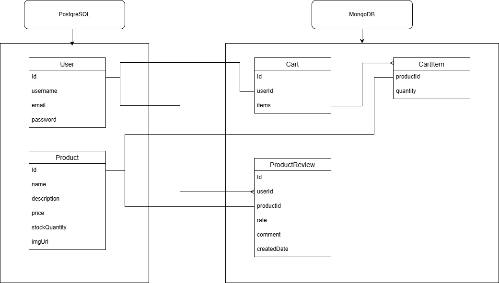

# Backend

This is the backend of the **MauriShop** project, built using **Spring Boot 3.4.4** and **Java 24**. It provides a RESTful API to manage users, products, reviews, and shopping carts. The backend supports both relational (PostgreSQL) and document (MongoDB) databases.

## Table of Contents
- [Backend](#backend)
  - [Table of Contents](#table-of-contents)
  - [Tech Stack](#tech-stack)
  - [Project Structure](#project-structure)
  - [Authentication \& Authorization](#authentication--authorization)
  - [APIs Overview and Endpoints](#apis-overview-and-endpoints)
    - [🔐 AuthController](#-authcontroller)
    - [👤 UserController](#-usercontroller)
    - [📦 ProductController](#-productcontroller)
    - [🛒 CartController](#-cartcontroller)
    - [📝 ProductReviewController](#-productreviewcontroller)
    - [🛡️ Access Roles](#️-access-roles)
  - [Environment Variables (suggested for production)](#environment-variables-suggested-for-production)
    - [PostgreSQL](#postgresql)
    - [MongoDB config (MongoDB Atlas)](#mongodb-config-mongodb-atlas)
    - [JWT config](#jwt-config)
    - [For the Frontend](#for-the-frontend)
    - [Key to create admin user](#key-to-create-admin-user)
  - [Requirements](#requirements)
  - [How to Run](#how-to-run)
  - [Notes](#notes)
  - [Visual Documentation](#visual-documentation)
      - [Diagrams Location](#diagrams-location)

## Tech Stack


- **Java 24**
- **Spring Boot 3.4.4**
- **PostgreSQL** for relational data (Users, Products)
- **MongoDB Atlas** for documents (Carts, Product Reviews)
- **JWT** for authentication and authorization
- **Role-based access control** (`USER`, `ADMIN`)
- **Maven** for dependency management

## Project Structure

This backend follows a feature-based modular structure, where the source code is organized by functionality rather than by layer. Each major functionality (such as authentication, user management, product management, and cart handling) has its logic split into dedicated packages (controllers, services, repositories, DTOs, etc.).

```
src/
│
├── main/
│   ├── java/com/mauricio/shop/
│   │   ├── config/        # Security config, JWT filters, CORS
│   │   ├── controller/    # REST controllers
│   │   ├── dto/           # Data Transfer Objects
│   │   ├── entity/        # JPA Entities (PostgreSQL)
│   │   ├── document/      # MongoDB documents
│   │   ├── repository/    # Spring Data Repositories
│   │   ├── service/       # Business logic
│   │   └── ShopApplication.java
│   └── resources/
│       └── application.properties
│       
└── pom.xml
```

## Authentication & Authorization

- Uses **JWT** stored in cookies for stateless authentication.
- Role-based access with `@PreAuthorize` annotations.
- Roles: `USER` and `ADMIN`.

## APIs Overview and Endpoints

### 🔐 AuthController
| Method | Route              | Description                      | Access |
| ------ | ------------------ | -------------------------------- | ------ |
| POST   | /api/auth/register | Register a new user              | ANY    |
| POST   | /api/auth/login    | Authenticate user and return JWT | ANY    |
| POST   | /api/auth/logout   | Clear JWT cookie                 | ANY    |

### 👤 UserController
| Method | Route                      | Description                            | Access        |
| ------ | -------------------------- | -------------------------------------- | ------------- |
| GET    | /api/users                 | Get all users                          | ADMIN         |
| GET    | /api/users/{id}            | Get user by ID                         | ADMIN         |
| GET    | /api/users/me              | Get authenticated user profile         | AUTHENTICATED |
| PUT    | /api/users/me              | Update authenticated user data         | AUTHENTICATED |
| PUT    | /api/users/{id}            | Update user data                       | ADMIN         |
| DELETE | /api/users/me              | Delete authenticated user              | AUTHENTICATED |
| DELETE | /api/users/{id}            | Delete user by ID                      | ADMIN         |
| POST   | /api/users/change-password | Change password for authenticated user | AUTHENTICATED |

### 📦 ProductController
| Method | Route              | Description                | Access |
| ------ | ------------------ | -------------------------- | ------ |
| GET    | /api/products      | Get all products           | ANY    |
| GET    | /api/products/{id} | Get product by ID          | ANY    |
| POST   | /api/products      | Create a new product       | ADMIN  |
| PUT    | /api/products/{id} | Update a product           | ADMIN  |
| PATCH  | /api/products/{id} | Partially update a product | ADMIN  |
| DELETE | /api/products/{id} | Delete a product           | ADMIN  |

### 🛒 CartController
| Method | Route                 | Description                       | Access        |
| ------ | --------------------- | --------------------------------- | ------------- |
| GET    | /api/cart             | Get authenticated user's cart     | AUTHENTICATED |
| POST   | /api/cart             | Add product to cart               | AUTHENTICATED |
| PUT    | /api/cart             | Update product quantities in cart | AUTHENTICATED |
| DELETE | /api/cart/{productId} | Remove product from cart          | AUTHENTICATED |

### 📝 ProductReviewController
| Method | Route                     | Description                                      | Access        |
| ------ | ------------------------- | ------------------------------------------------ | ------------- |
| GET    | /api/reviews/product/{id} | Get reviews for a product                        | ANY           |
| GET    | /api/reviews/me           | Get reviews created by the authenticated user    | AUTHENTICATED |
| POST   | /api/reviews              | Add a review to a product                        | AUTHENTICATED |
| PUT    | /api/reviews/{reviewId}   | Edit review (if owned by the authenticated user) | AUTHENTICATED |
| DELETE | /api/reviews/{reviewId}   | Delete review (if owned by user or admin)        | AUTHENTICATED |

### 🛡️ Access Roles
| Role          | Description                               |
| ------------- | ----------------------------------------- |
| ANY           | No authentication required                |
| AUTHENTICATED | Valid JWT required (includes ADMIN users) |
| ADMIN         | User must have ADMIN role                 |

## Environment Variables (suggested for production)
Variables that are needed in the `application.properties` file and should be trated as secrets.

### PostgreSQL
- `spring.datasource.url=${POSTGRESQL_URL}`
- `spring.datasource.username=${POSTGRESQL_USERNAME}`
- `spring.datasource.password=${POSTGRESQL_PASSWORD}`

### MongoDB config (MongoDB Atlas)
- `spring.data.mongodb.uri=${MONGODB_URI}`

### JWT config
- `jwt.secret=${JWT_SECRET_KEY}`
- `jwt.cookie.secure=${JWT_COOKIE_SECURE}`
- `jwt.cookie.samesite=${JWT_COOKIE_SAMESITE}`

### For the Frontend
- `app.frontend.url=${FRONTEND_URL}`

### Key to create admin user
- `app.admin.key=${APP_ADMIN_KEY}`

## Requirements

- Java 24
- Maven 3.9+
- PostgreSQL 14+ running instance
- MongoDB Atlas cluster or local MongoDB instance

## How to Run

1. Make sure you have Java 24 and Maven installed.
2. Configure your `application.properties` with PostgreSQL and MongoDB credentials.
3. Run the application:

```bash
./mvnw spring-boot:run
```
## Notes

- The app uses both PostgreSQL and MongoDB depending on the entity type.
- Designed with scalability in mind to be deployed on AWS (EC2, RDS, MongoDB Atlas).
- Optionally containerizable for Kubernetes (not yet implemented).

## Visual Documentation
This section is reserved for visual aids to help understand the system architecture of the MauriShop backend.

<details> <summary><strong>🔽 Database Diagram</strong></summary>  </details>


---

#### Diagrams Location
All diagrams used in this documentation are located in the [`/docs`](../docs) directory at the root of the project.
