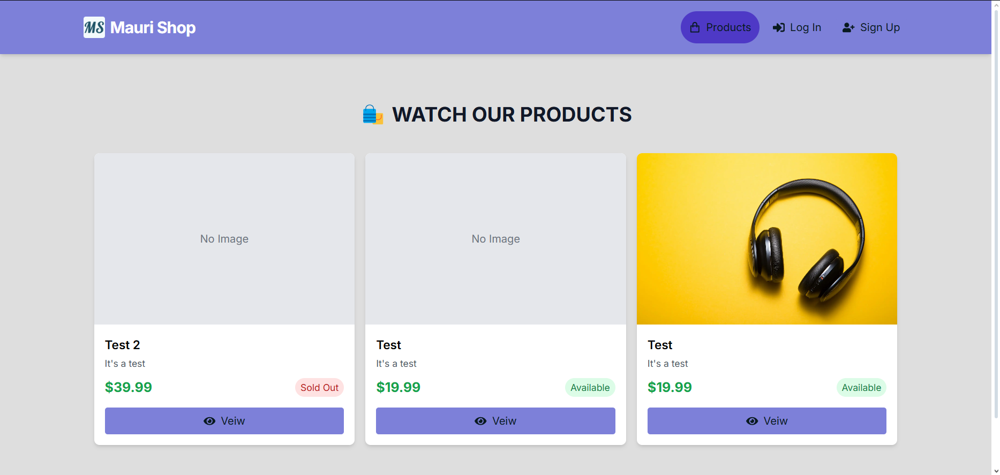
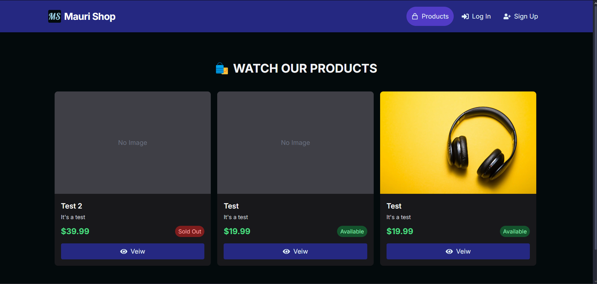
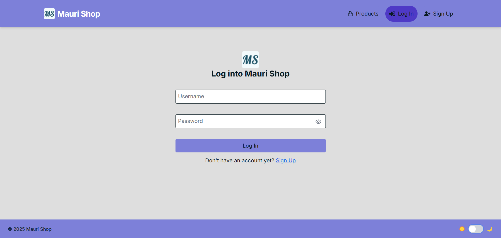
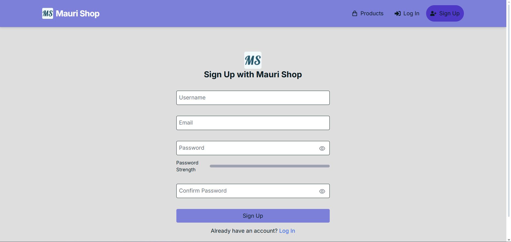
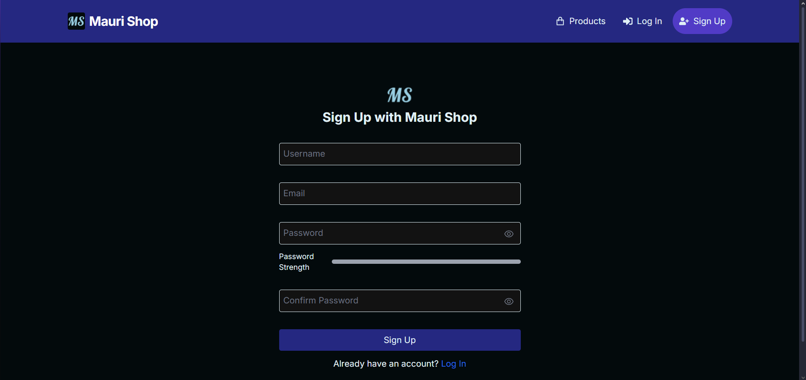

# Frontend

This is the frontend of the **MauriShop** project — a modern, responsive online store interface built with **React** and **Next.js**. It interacts with the Spring Boot backend through a secure REST API and handles authentication, routing, and dynamic rendering of products, reviews, and user data.

## Table of Contents

- [Frontend](#frontend)
  - [Table of Contents](#table-of-contents)
  - [Tech Stack \& Tools](#tech-stack--tools)
  - [Project Structure](#project-structure)
  - [Authentication \& Authorization](#authentication--authorization)
  - [Features](#features)
  - [How to Run](#how-to-run)
  - [Environment Variables](#environment-variables)
  - [Notes](#notes)
  - [Preview](#preview)
    - [Main page (light/dark)](#main-page-lightdark)
    - [Login page (light/dark)](#login-page-lightdark)
    - [Sign Up page (light/dark)](#sign-up-page-lightdark)

## Tech Stack & Tools


- **Next.js 14:** App Router with Server-Side Rendering (SSR)
- **React 18**
- **TailwindCSS:** Utility-first styling
- **Redux Toolkit** — Global state management
- **Axios:** HTTP requests with JWT support
- **JWT Authentication:** stored in secure cookies
- **React Hooks:** for state and lifecycle
- **ESLint + Prettier:** for code style and quality

## Project Structure

```
frontend/
├── src/ 
│   ├── app/                 # Next.js App Router structure 
│   │   ├── page.tsx         # Main entrypoint 
│   │   ├── layout.tsx       # Global layout (header/footer) 
│   │   ├── global.css       # Tailwind and global styles 
│   │   └── ...              # Nested routes (products, cart, etc.) 
│   ├── components/          # Reusable UI components (Navbar, ProductCard, etc.) 
│   ├── lib/                 # API functions, helpers
│   ├── context/             # Providers
│   ├── hooks/               # Custom Hooks            
│   ├── store/               # Redux store and slices
│   └── middleware.tsx       # Path protection for unauthenticated users
├── public/                   # Static assets 
```

## Authentication & Authorization

- **JWT-based auth**: Tokens are stored in cookies (HTTP-only, secure, SameSite).
- **Private routes**: Authenticated pages protected via client checks and backend verification.
- **Roles**: UI adapts to roles (`USER`, `ADMIN`) to show/hide buttons, forms, etc.

## Features

- 🔐 **Secure login/signup** with JWT
- 🛍️ **Product listing & details**
- 🛒 **Add/remove/edit cart**
- ✍️ **Review system** for authenticated users
- 🧾 **User profile**
- 💡 **Light/Dark theme toggle**
- 🌍 **Global state** management using Redux Toolkit
- 🧪 **Client-side validation**
- 🌐 **API integration** with the backend
- 📱 **Responsive layout** for mobile/desktop

## How to Run

```bash
# 1. Clone the repo
git clone https://github.com/Maveto/full-stack-assessment.git
cd frontend

# 2. Install dependencies
npm install

# 3. Create your .env file
cp .env.example .env.local

# 4. Start the dev server
npm run dev

# App will be running on http://localhost:3000
```

## Environment Variables
Create a .env.local file at the root with this variable (Important to add the `/api` at the end ):

`NEXT_PUBLIC_API_URL=https://your-backend-url.com/api`

## Notes
 - Built to work seamlessly with the MauriShop Spring Boot backend.
 - Uses JWT with cookies — set withCredentials: true in Axios.
 - You can deploy this easily to Vercel, Netlify, or any static host.
  
## Preview

### Main page (light/dark)



### Login page (light/dark)



### Sign Up page (light/dark)



----
\>🔗 See the [backend README](../backend/README.md) for setup and API reference.
